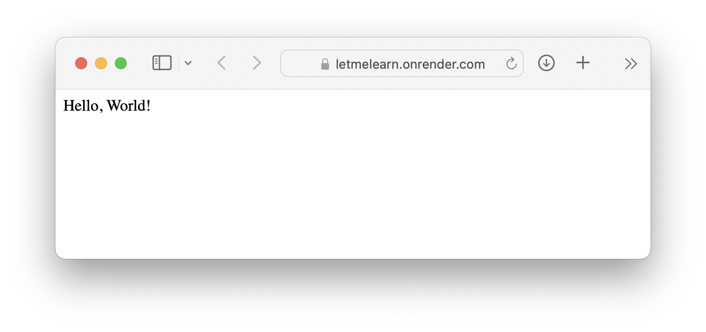
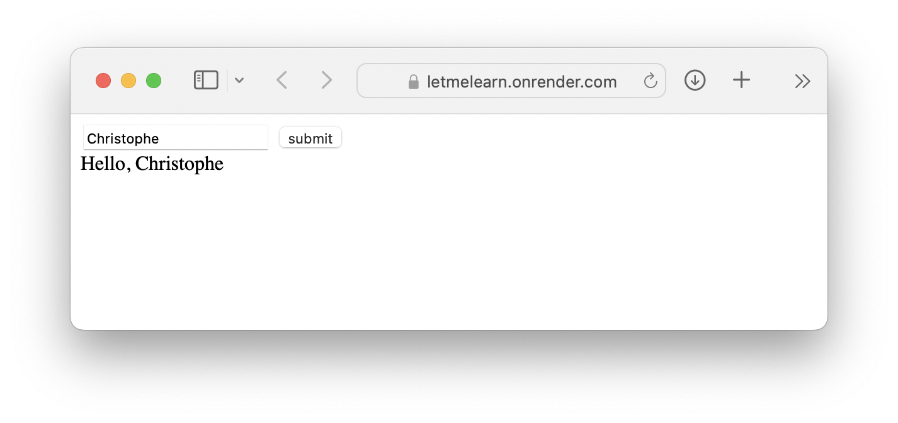
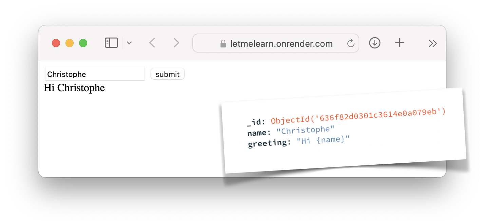
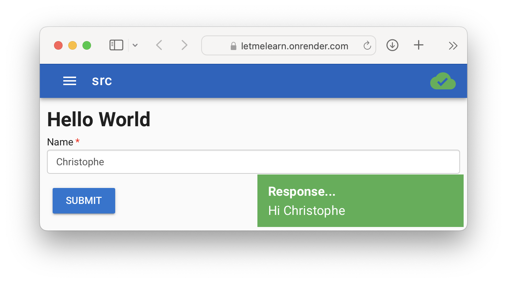

# Let Me Learn

> a simple app to support learning definitions, words,...

## Rationale

When my daugther's quizlet was in danger of becoming a paid service, it was once again time to spend a few hours to build a simple app to help her out ;-)

Of course it also included a few personal itches to be scratched:

* Since [the last such app](https://github.com/christophevg/howifeel), Heroku was no longer "free" and so I had to look for another free Python app hosting solution. With this app, I'm going to explore [Render](https://render.com).
* Over the years I've been building [baseweb](https://github.com/christophevg/baseweb), a very rapid prototyping environment. With this app, I'm going to include authorization support using OAuth, with support for Google accounts as an authenticating federated login.
* After experimenting with PWAs in [the last such app](https://github.com/christophevg/howifeel), I want to further integrate all that support in a more generic way in [baseweb](https://github.com/christophevg/baseweb).

So, the setup/architecture of this application will be my (currently) prefered one:

* a SP(A/)PWA
* using OAuth/OpenID Connect for authentication/authorization
* to access data from a RESTful service

## Implementation Steps

- [x] Setup a Hello World-like service on Render
  - [x] Setup a Hello World Flask app
    
  - [x] Split service in ui and api
    
  - [x] Connect api to MongoDB Cloud instance
    
- [ ] Apply baseweb + sppwa + oauth
  - [x] Apply baseweb
    
  - [x] Enable PWA usage
    

      
    
  
  - [x] Add login + OAuth/OpenIDC
  - [x] Add support for Google Accounts
- [ ] Implement application logic
  - [ ] Implement "create a set"
  - [ ] Implement "learn a set"
  - [ ] Implement "invitations"
  - [ ] Implement "import sets"
